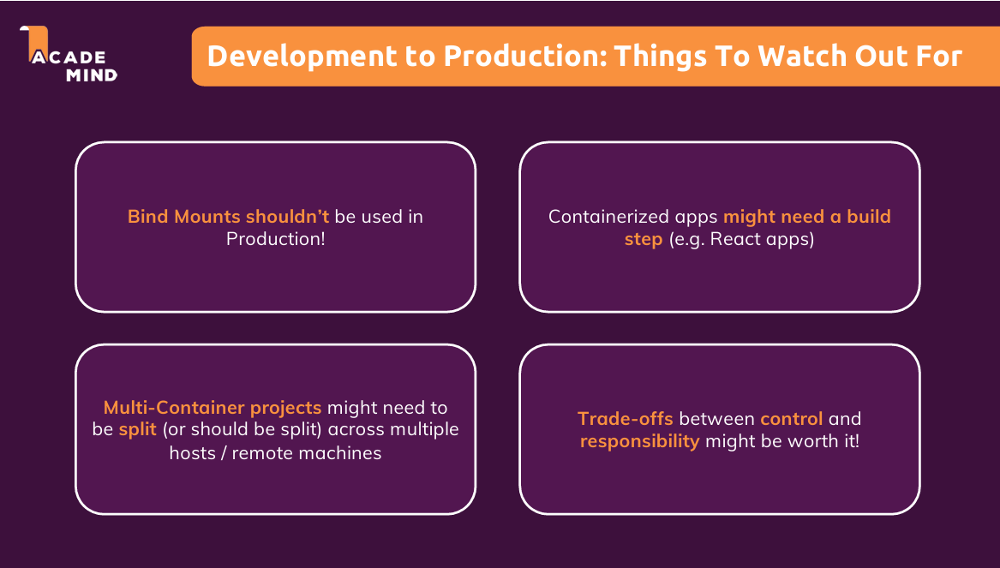

# Ghi chú cho bản thân

## Mục tiêu của section:

Tại section này, chúng ta sẽ tiến hành deploy một Docker Container lên trên một Cloud Service mà cụ thể là **AWS**. Nghĩa là khác với các section trước khi chúng ta chỉ tập trung ở môi trường **Development**, ở section này chúng ta sẽ làm quen với môi trường **Production**.

### Deploy lên môi trường Production:

#### Vấn đề cần lưu ý:

**1. Không nên sử dụng Bind Mounts**:

- Trong môi trường **Production**, chúng ta không nên sử dụng **Bind mounts**.

**2. Containerized App có thể cần được set up khác đi:**

- Một số chương trình chẳng hạn như **React App** sẽ cần một **build step** - giai đoạn mà code được convert và optimize, giai đoạn này sẽ xảy ra sau khi chúng ta kết thúc quá trình viết code và trước khi deploy app lên trên môi trường production.

**3. Multi-Container project có thể phải bị chia nhỏ ra**

- Trong môi trường production, một chương trình yêu cầu nhiều container có thể sẽ phải bị **chia nhỏ** ra, và khi đó mỗi container sẽ chạy ở mỗi **một host machine riêng biệt** chứ không nhất thiết ở trên **cùng một host machine**.

**4. Trade-off Reponsibility**

- Trong một số trường hợp, chúng ta sẽ phải cân nhắc giải pháp đánh đổi cho việc **sẽ có ít quyền control hơn đối với một deploy platform** để đổi lại việc **ít phải quan tâm đến một vấn đề** nào đó. Bởi lẽ nếu chúng ta control mọi thứ trên host machine, chúng ta sẽ phải chịu trách nhiệm cho quá nhiều thứ, chẳng hạn như chúng ta phải quan tâm đến vấn đề bảo mật và tương tự.

